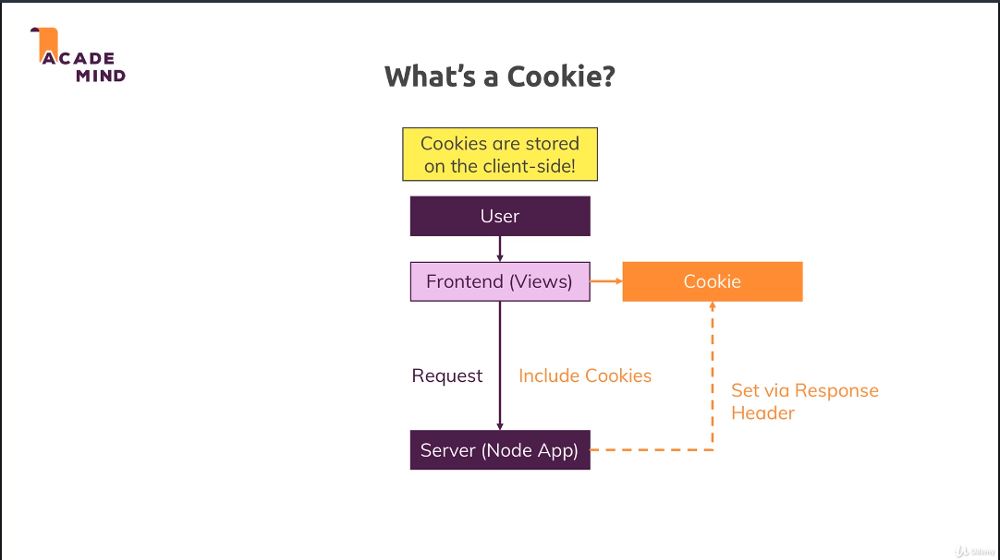

# Node JS Bootcamp

1. [Install NodeJS](https://nodejs.org/en/)
1. [Offical Docs](https://nodejs.org/en/docs/guides/)

## Running a node js file

```cmd
node first-app.js
```

## What is NodeJS?

1. A JavaScript runtime
1. JavaScript on the server
1. We use Node to run JS out of the browser
1. Runs on V8
   - Written in c++
1. Can access local file system
1. Does NOT run in the browser
1. No DOM (No browser)
1. Not limited to the server
   - It's a JS runtime, can execute any JS code w/ node.js
   - Utility scripts, build tools
1. We use it to run on our server
   - Create server & listen to incoming requests
1. We use it to create business logic
   - Handle requests, validate input, connect to DB
1. We use it to handle requests
   - Return responses (Rendered HTML, Json)

## The Basics

1. [Request/Response Headers](https://developer.mozilla.org/en-US/docs/Web/HTTP/Headers)
1. Single Thread, Event Loop, Blocking Code
   
   - [Link](https://nodejs.org/en/docs/guides/dont-block-the-event-loop/)
1. The Event Loop
   
   - Takeaway, event loop prioritizes jobs so that short jobs take priority
     - Performance is key
   - [Link](https://nodejs.org/en/docs/guides/event-loop-timers-and-nexttick/)
1. Creating a Server

   ```js
   // Creating a server
   // Things like Express.js make a lot of this easier
   const http = require('http');
   const routes = require('./routes');

   console.log(routes.someText);

   const server = http.createServer(routes.handler);

   // Starts a process where node will keep it running for incoming requests
   server.listen(3000);
   ```

# Development Workflow & Debugging

## NPM Scripts

1. You need [NPM](https://www.npmjs.com/)
1. Set up a NPM project
   ```cmd
   npm init
   ```
   - Creates a package.json file
1. Run a project
   ```cmd
   npm start
   ```

## 3rd Party Packages

1. Server Auto Restart (nodemon)
   - [Link](https://www.npmjs.com/package/nodemon)
   ```cmd
   npm install nodemon
   ```
   - You can determine 'how' it gets installed
     ```
     npm install nodemon --save-dev
     ```
     - Installs just on your project, not globally
   - Can just reinstall w/ `node install`
1. Nodemon is nice
   - Restarts your server when you make a change
1. Debugging Nodejs
   - [Node Link](https://nodejs.org/en/docs/guides/debugging-getting-started/)
   - [VS Code Link](https://code.visualstudio.com/docs/nodejs/nodejs-debugging)
   - VS Code debugger lets you change values while debugging
   - Debugger tab, double cliick on variable

# Express.js

[Express.js](https://expressjs.com/en/starter/installing.html) is a Node.js framework

- A package that adds a bunch of utility functions and tools
- A clear set of rules on how the app should be built (middleware)
- Highly extensible and other packages can be plugged into it (other middleware)

Express.js relies heavily on middleware functions

- Easily add them by calling use()
- Middleware functions handle a request and should call next() to forward the request to the next function in line or send a response

1. This will be a production dependency
   ```cmd
   npm install --save express
   ```
1. It's all about Middleware

   ```js
   app.use((req, res, next) => {
   	console.log('In the middleware');
   	next();
   });

   app.use((req, res, next) => {
   	console.log('In another middleware');
   	res.send('<h1>Hello from Express!</h1>');
   });
   ```

   - use hits all http requests (get, post, put exist)

## Why?

1. Server Logic is complex
   - Listen to request 'on' event
   - Parse request
   - Check url routes
1. We want to focus on Business Logic, not nitty-gritty details
   - Use a framework for this!

## Alternatives

1. Vanilla Node.js
   - Depending on complexity of app
1. Adonis.js
   - Laravel/php inspired
1. Koa
1. Sails.js

# Templating Engines

The way you pass data into a templatle engine doesn't change

Just the way you use it

1. EJS
   ```ejs
   <p><%= name %></p>
   ```
   - Use normal html and plain js in templates
   - [Official Docs](https://ejs.co/#docs)
1. Pug (Jade)
   ```pug
   p #{name}
   ```
   - Minimal html and custom template language
   - [Official Docs](https://pugjs.org/api/getting-started.html)
1. Handlebars
   ```handlebars
   <p>{{ name }} </P>
   ```
   - Normal HTML, custom template language
   - Can't run any logic inside the template
     - Have to do it all in js
     - Which is good. Less in template, more in code where it belongs
   - [Official Docs](https://handlebarsjs.com/)

## MVC

[Explanation Link](https://developer.mozilla.org/en-US/docs/Glossary/MVC)

# Databases

## MySQL

1. [MySQL](https://dev.mysql.com/downloads/mysql/)
1. [GitHub](https://github.com/sidorares/node-mysql2)

### Sequelize

[Sequelize](https://sequelize.org/)

1. A JS ORM
   - Obejct Relational Mapping Library
1. Models
   - User, Product
1. Instances
   - User.build()
1. Queries
   - User.findAll()
1. Associations
   - User.hasMany(Product)

## MongoDB

1. [Site Link](https://www.mongodb.com/)
   - Popular NoSQL option

### Mongoose

[Mongoose](https://mongoosejs.com/docs/)

1. ODM
   - Object Document Mapping Library
   - Like ORM but for documents
1. Work w/ Schemas & Models
1. Use Instances of Schemas & Models
1. Run Queries

# Sessions & Cookies

## Cookie

- Example: Am I Logged In?
- Store this information in the browser (client)
- [Explanation Link](https://developer.mozilla.org/en-US/docs/Web/HTTP/Cookies)



## Sessions

- Like a cookie, but server side
- [Explanation Link](https://www.quora.com/What-is-a-session-in-a-Web-Application)


# Authentication


## CSRF Attacks

1. Cross-Site Request Forgery
1. Session gets stolen
1. Need to make sure the session isn't available on any other pages but your own


