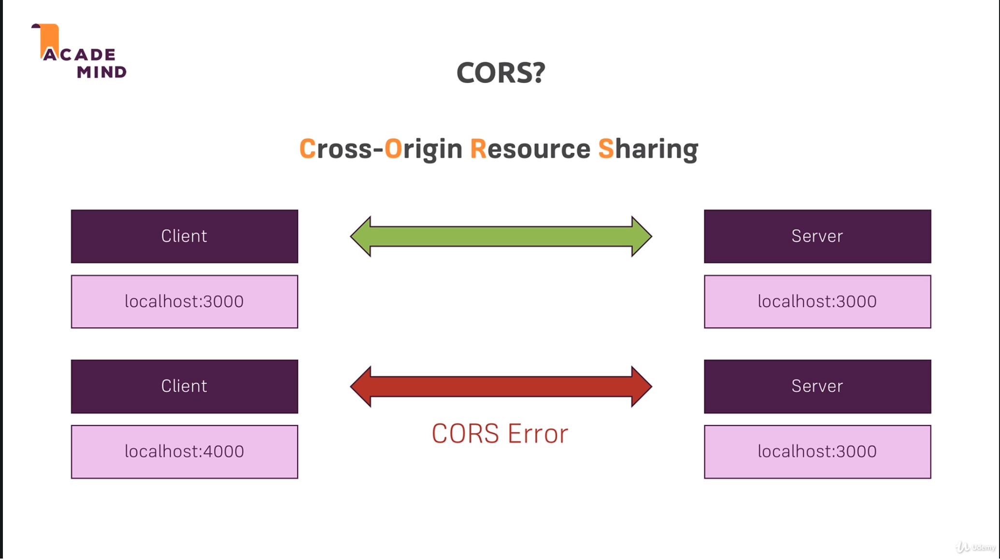

# Node JS Bootcamp

1. [Install NodeJS](https://nodejs.org/en/)
1. [Offical Docs](https://nodejs.org/en/docs/guides/)

## Running a node js file

```cmd
node first-app.js
```

## What is NodeJS?

1. A JavaScript runtime
1. JavaScript on the server
1. We use Node to run JS out of the browser
1. Runs on V8
   - Written in c++
1. Can access local file system
1. Does NOT run in the browser
1. No DOM (No browser)
1. Not limited to the server
   - It's a JS runtime, can execute any JS code w/ node.js
   - Utility scripts, build tools
1. We use it to run on our server
   - Create server & listen to incoming requests
1. We use it to create business logic
   - Handle requests, validate input, connect to DB
1. We use it to handle requests
   - Return responses (Rendered HTML, Json)

## The Basics

1. [Request/Response Headers](https://developer.mozilla.org/en-US/docs/Web/HTTP/Headers)
1. Single Thread, Event Loop, Blocking Code
   
   - [Link](https://nodejs.org/en/docs/guides/dont-block-the-event-loop/)
1. The Event Loop
   
   - Takeaway, event loop prioritizes jobs so that short jobs take priority
     - Performance is key
   - [Link](https://nodejs.org/en/docs/guides/event-loop-timers-and-nexttick/)
1. Creating a Server

   ```js
   // Creating a server
   // Things like Express.js make a lot of this easier
   const http = require('http');
   const routes = require('./routes');

   console.log(routes.someText);

   const server = http.createServer(routes.handler);

   // Starts a process where node will keep it running for incoming requests
   server.listen(3000);
   ```

# Development Workflow & Debugging

## NPM Scripts

1. You need [NPM](https://www.npmjs.com/)
1. Set up a NPM project
   ```cmd
   npm init
   ```
   - Creates a package.json file
1. Run a project
   ```cmd
   npm start
   ```

## 3rd Party Packages

1. Server Auto Restart (nodemon)
   - [Link](https://www.npmjs.com/package/nodemon)
   ```cmd
   npm install nodemon
   ```
   - You can determine 'how' it gets installed
     ```
     npm install nodemon --save-dev
     ```
     - Installs just on your project, not globally
   - Can just reinstall w/ `node install`
1. Nodemon is nice
   - Restarts your server when you make a change
1. Debugging Nodejs
   - [Node Link](https://nodejs.org/en/docs/guides/debugging-getting-started/)
   - [VS Code Link](https://code.visualstudio.com/docs/nodejs/nodejs-debugging)
   - VS Code debugger lets you change values while debugging
   - Debugger tab, double cliick on variable

# Express.js

[Express.js](https://expressjs.com/en/starter/installing.html) is a Node.js framework

- A package that adds a bunch of utility functions and tools
- A clear set of rules on how the app should be built (middleware)
- Highly extensible and other packages can be plugged into it (other middleware)

Express.js relies heavily on middleware functions

- Easily add them by calling use()
- Middleware functions handle a request and should call next() to forward the request to the next function in line or send a response

1. This will be a production dependency
   ```cmd
   npm install --save express
   ```
1. It's all about Middleware

   ```js
   app.use((req, res, next) => {
   	console.log('In the middleware');
   	next();
   });

   app.use((req, res, next) => {
   	console.log('In another middleware');
   	res.send('<h1>Hello from Express!</h1>');
   });
   ```

   - use hits all http requests (get, post, put exist)

## Why?

1. Server Logic is complex
   - Listen to request 'on' event
   - Parse request
   - Check url routes
1. We want to focus on Business Logic, not nitty-gritty details
   - Use a framework for this!

## Alternatives

1. Vanilla Node.js
   - Depending on complexity of app
1. Adonis.js
   - Laravel/php inspired
1. Koa
1. Sails.js

# Templating Engines

The way you pass data into a templatle engine doesn't change

Just the way you use it

1. EJS
   ```ejs
   <p><%= name %></p>
   ```
   - Use normal html and plain js in templates
   - [Official Docs](https://ejs.co/#docs)
1. Pug (Jade)
   ```pug
   p #{name}
   ```
   - Minimal html and custom template language
   - [Official Docs](https://pugjs.org/api/getting-started.html)
1. Handlebars
   ```handlebars
   <p>{{ name }} </P>
   ```
   - Normal HTML, custom template language
   - Can't run any logic inside the template
     - Have to do it all in js
     - Which is good. Less in template, more in code where it belongs
   - [Official Docs](https://handlebarsjs.com/)

## MVC

[Explanation Link](https://developer.mozilla.org/en-US/docs/Glossary/MVC)

# Databases

## MySQL

1. [MySQL](https://dev.mysql.com/downloads/mysql/)
1. [GitHub](https://github.com/sidorares/node-mysql2)

### Sequelize

[Sequelize](https://sequelize.org/)

1. A JS ORM
   - Obejct Relational Mapping Library
1. Models
   - User, Product
1. Instances
   - User.build()
1. Queries
   - User.findAll()
1. Associations
   - User.hasMany(Product)

## MongoDB

1. [Site Link](https://www.mongodb.com/)
   - Popular NoSQL option

### Mongoose

[Mongoose](https://mongoosejs.com/docs/)

1. ODM
   - Object Document Mapping Library
   - Like ORM but for documents
1. Work w/ Schemas & Models
1. Use Instances of Schemas & Models
1. Run Queries

# Sessions & Cookies

## Cookie

- Example: Am I Logged In?
- Store this information in the browser (client)
- [Explanation Link](https://developer.mozilla.org/en-US/docs/Web/HTTP/Cookies)


## Sessions

- Like a cookie, but server side
- [Explanation Link](https://www.quora.com/What-is-a-session-in-a-Web-Application)


# Authentication


## CSRF Attacks

[Documentation](https://www.acunetix.com/websitesecurity/csrf-attacks/)

1. Cross-Site Request Forgery
1. Session gets stolen
1. Need to make sure the session isn't available on any other pages but your own


## Encrypting Passwords

[bcrypt](https://github.com/dcodeIO/bcrypt.js)

## Sending Emails

[SendGrid](https://sendgrid.com/)

1. Annoying due to needing to verify sender
   - Ended up using my gmail account (which wasn't recommended)

# Validation

1. [Express Validator](https://express-validator.github.io/docs/)
1. [validator.js](https://github.com/validatorjs/validator.js)
   - Used behind the scenes

# Error Handling

[Express Error Handling](https://expressjs.com/en/guide/error-handling.html)

## Http Response Codes

[Status Codes](https://developer.mozilla.org/en-US/docs/Web/HTTP/Status)

1. 2xx (Success)
   - 200: Operation Succeeded
   - 201: Success, resource created
1. 3xx (Redirect)
   - 301: Moved permanently
1. 4xx (Client side error)
   - 401: Not authenticated
   - 403: Not authorized
   - 404: Not fouond
   - 422: Invalid Input
1. 5xx (Server side error)
   - 500: Server-side Error

# File Upload/Download

1. Using an extension called [Multer](https://github.com/expressjs/multer)
   - BodyParser can't parse file data
   - Parses requests for 'mixed' (file) data
   - We'll keep BodyParser as we still have forms (sign up) that only have url encoded data
1. Creating pdf
   - PDFKit
   - [Styling PDF](http://pdfkit.org/docs/text.html)
1. [Streaming Files](https://www.freecodecamp.org/news/node-js-streams-everything-you-need-to-know-c9141306be93/)

# Pagination, Async, and Payments

1. Pagination
   - With Mongoose and MongoDB, we can call Limit() and Skip() functions
     - These will allow us to get a specified number and skip a specificed number
   - How to do with a regular db?
     - [Link](https://stackoverflow.com/questions/3799193/mysql-data-best-way-to-implement-paging)
1. Async Requests
   - [fetch API](https://developers.google.com/web/updates/2015/03/introduction-to-fetch)
   - [AJAX](https://developer.mozilla.org/en-US/docs/Web/Guide/AJAX/Getting_Started)
1. Payments
   - Using [Stripe](https://dashboard.stripe.com/test/dashboard)
     - All test data
   - Set up account
   - You'll have a public and private api key (private stays in env)
   - Make sure you add name to your account

# Rest API

Representational State Transfer

- Transfer data instead of User Interfaces


## Data Formats


## Routing

- Routing uses http methods (GET/POST)
  - More than just GET and POST


## Principles


## CORS

- Can't share resources across domains



- But we **want** to allow this, so we can overwrite this
- This makes sense for some things, but for REST apis, it doesn't
- We need to tell the browser to accept by setting specific headers

## Authorization

1. When a user is authenticated, we don't store any session data on the api
   - API's are 'stateless'
1. Instead we store a token on the client side
   - That stored token is sent to authorize subsequent requests


1. Using jsonwebtoken for node.js JWT
   - [JWT Docs](https://jwt.io/)

# Web Sockets

1. Allows you to build real time web services
1. [Socket.io](https://socket.io/)


1. Install on Server

   ```bash
   npm install --save socket.io
   ```

   ```js
   const server = app.listen(8080);

   const io = require('socket.io')(server);
   io.on('connection', (socket) => {
   	console.log('Client Connected');
   });
   ```

1. Install on Client

   ```bash
   npm install --save socket.io-client
   ```

   ```js
   import openSocket from 'socket.io-client';

   openSocket('http://localhost:8080');
   ```

1. [Handling CORS](https://socket.io/docs/v3/handling-cors/)
1. [Alternative Websocket](https://www.npmjs.com/package/express-ws)

# GraphQL

[Documentation](https://graphql.org/)


- Think database query but for front end data (from api)
- You send your query as a parameter
  - GraphQL specific language

## REST API Limitations


## GraphQL Operation Types


## GraphQL Setup

```js
app.use(
	'/graphql',
	graphqlHTTP({
		schema: graphqlSchema,
		rootValue: graphqlResolver,
		graphiql: true,
	})
);
```

1. The 'graphiql' setting allows you to visit:
   - http://localhost:8080/graphql
   - Which allows you to write queries
     
1. Custom Error Handling

   ```js
   app.use(
   	'/graphql',
   	graphqlHTTP({
   		schema: graphqlSchema,
   		rootValue: graphqlResolver,
   		graphiql: true,
   		formatError(err) {
   			if (!err.originalError) {
   				return err;
   			}

   			const data = err.originalError.data;
   			const message = err.message || 'An error occured';
   			const code = err.originalError.code || 500;

   			return { message: message, status: code, data: data };
   		},
   	})
   );
   ```

# Deployment

1. dotenv is how I'm protecting password and api information
   - I'll need to figure out how heroku does dotenv
1. It's recommended to use the production api for stripe...I'm staying with test
   - I don't actually want real transactions
1. Setting secure response headers
   - [Helment](https://www.npmjs.com/package/helmet)
1. Compressing Assets
   - [expressjs Compression](https://github.com/expressjs/compression)
   - Files that are served to client are much smaller
   - Only use is your hosting provider doesn't (hosting on own server)
1. Logging
   - [morgan](https://www.npmjs.com/package/morgan)
1. [Digial Ocean Setup](https://www.digitalocean.com/community/tutorials/how-to-set-up-a-node-js-application-for-production-on-ubuntu-20-04)
   - I'll have deployment notes in my personal wiki once I get this stood up

# Testing

1. We are testing the api we made after converting to async await
1. Using [mocha](https://mochajs.org/) and [chai](https://www.chaijs.com/) to test
   - Needs a 'test' folder
1. mocha is used to run tests and define the 'it' structure of a test
   ```js
   it('should add numbers correctly', function () {
   	const num1 = 2;
   	const num2 = 3;
   });
   ```
1. chai is used to define success conditions

   ```js
   const expect = require('chai').expect;

   it('should add numbers correctly', function () {
   	const num1 = 2;
   	const num2 = 3;

   	expect(num1 + num2).to.equal(5);
   });
   ```
